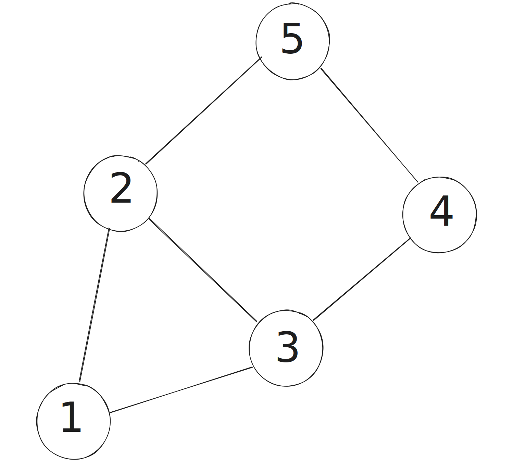

# Gnutella 

## Quickstart
Installer les dependances
````
go get
````
Executer le programme
````
go run ./main.go
```` 

## Structure du projet 
Dossiers : 
  - model : contient les struct pour serialiser et deserialiser en yaml
  - nodes : contient les fichiers yaml de chaque nodes
  - repository : contient les methodes de lecture de fichiers 
  - Services : contient les services contenant la logique de chaque noeud 

## Données stockées par les noeuds/servers
Chaque noeud disposera d'un entrepot sous forme de fichier `entrepot.yaml`.
L'entrepot contient les metadonnées du contenu qui peut être partagé avec les autres noeuds.


### Structure de données au sein des noeuds:

Un noeud est representé par la struct Services.server et encapsule :
- Logger             : ecrit dans le fichier de log app.log
- Name               : nom du noeud
- entrepotRepository : responsable de l'accès au fichier d'entrepot
- nodeConfig         : configuration du node chargé depuis le fichier node.yamé

Un noeud peut envoyer et recevoir des requetes représentées par la struct model.Query

Une requète a les propriétés suivantes :
 - Id : id unique généré en tant que uuid V4 reduisant la propabilité de collisions
 - TTL : time to live de la requete
 - Type : Requete de type recherche(type = 1), ou reponse(type =0) 
 - Data : dans le cas d'un requete a titre a rechercher, dans le cas d'un reponse l'adresse du noeud possédant le contenu 
 - Path : List de noeud representant le chemin traversé par la requete
 - SourceAddress : l'addresse du noeud emeteur de la requete

### Algorithme
Methode d'initatition de la requete (server.IniateQuery)
```
Un server n1 initie une requete avec le titre du film f1 et la transmet a ses voisins.

n1 attend un message (server.Start())
```

Algorithme de traitement de message (methode : server.HandleQuery())
```
server n attend message ()

Si message = requete (type = 1)
    Si le noeud.entrepot.title == message.data :
      Repond au noeud emeteur avec une reponse p1

    Decremente le TTL 
    Si TTL > 0
      ajoute l'adresse local de n a message.Path 
      pour chaque  voisins de non inclus dans message.Path // pour eviter les boucles
        envoyer le message

Sinon message = reponse (type = 0)
    si message.Path[0] == adresse locale
        le noeud actuel est la source original de la requete de recherche
    Sinon
     nextHop = l'adresse du noeud qui precede le noeud actuelle dans message.Path 
     renvoyer la reponse a nextHop pour propager la reponse

```
Chaque serveur peut traiter plusieurs connection en parrallele grace a la goroutine HandleConnection()

La methode Server.NewServer() est responsable de l'initialisation d'un noeud (chargement de config, etc.. )

Les logs sont ecrits dans un fichier app.log généré lors de l'execution du programme

## Representation du réseau


